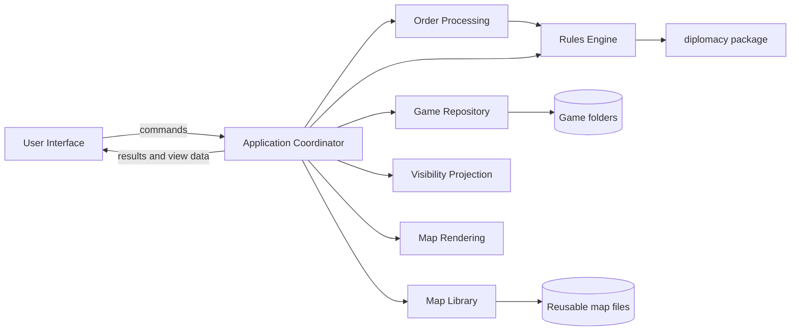

# Functional Structure

## Purpose

This document defines the application's high-level software subsystems, their responsibilities and the contracts between them.
It complements the [functional specification](functional-specification.md) and [user interface contract](user-interface-contract.md), which remain authoritative for product behaviour and user-visible interaction.

The application runs as one Python process.
Subsystem boundaries are typed in-process APIs rather than network or deployment boundaries.
Each subsystem depends on shared contracts and explicit ports so it can be implemented and tested independently.

The operation names in this document describe stable API capabilities.
Exact Python signatures and field-level schemas belong to detailed design.

## Detailed Designs

- [Subsystem API Contracts](api-contracts.md)
- [Technology Decisions](technology-decisions.md)
- [Storage Schema](storage-schema.md)
- [Testing Strategy](testing-strategy.md)
- [User Interface](subsystems/user-interface.md)
- [Application Coordinator](subsystems/application-coordinator.md)
- [Game Repository](subsystems/game-repository.md)
- [Map Library](subsystems/map-library.md)
- [Order Processing](subsystems/order-processing.md)
- [Rules Engine](subsystems/rules-engine.md)
- [Visibility Projection](subsystems/visibility-projection.md)
- [Map Rendering](subsystems/map-rendering.md)

## Architecture Overview

The Application Coordinator is the centre of the dependency graph because it implements cross-subsystem use cases.
Domain and infrastructure subsystems do not call the User Interface or the Application Coordinator.
The User Interface does not bypass the coordinator to access repositories or domain services.

## Shared Contract Model

Subsystem APIs exchange immutable application-owned values.
The shared contract model defines identifiers, snapshots, requests, results and error categories without containing business workflows.

The principal contract values are:

| Contract | Purpose |
| --- | --- |
| `MapDefinition` | A validated map's topology, powers, starting setup, presentation anchors and safe SVG assets. |
| `StartingSetup` | A starting phase and state, initially taken from a configured map and optionally adjusted for one game. |
| `GameSnapshot` | A consistent read-only view of a game, its configuration and phase index. |
| `PhaseSnapshot` | The state, submissions, finalisation flags and recorded results for one phase. |
| `OrderCandidate` | The parser's best interpretation of one submitted line, retaining its source text. |
| `OrderSubmission` | A power's preserved text, canonical interpretations, validation results and effective orders. |
| `EffectiveOrder` | A submitted, replacement or omitted-unit order ready for display or adjudication. |
| `PhaseRequirements` | The powers and units that can issue orders in the selected phase. |
| `AdjudicationProposal` | Recorded order results, the next phase identifier and the proposed next state. |
| `ProjectedMapState` | State and order information permitted for one rendering perspective. |
| `RenderRequest` | Display mode, label mode, viewport and output dimensions. |
| `MapScene` | A displayable map composition containing the permitted map layers. |
| `ImageArtifact` | Clipboard-ready image bytes and dimensions. |
| `Revision` | A repository-issued token identifying the snapshot on which a mutation is based. |

Shared values contain application concepts rather than filesystem representations, GUI toolkit objects or `diplomacy` package objects.
Identifiers remain stable across serialisation and subsystem boundaries.

## Subsystems

### User Interface

The User Interface presents the application state and translates user interaction into coordinator commands.
It owns transient widget state such as the selected tab, active editor and open warning panel.
It delegates game operations, persistence, rules, visibility and rendering through the Application Coordinator.

The User Interface consumes the `ApplicationService` contract provided by the coordinator.
That contract covers:

- Opening, creating and switching games.
- Selecting phases and perspectives.
- Editing and finalising order submissions.
- Resolving and advancing a phase.
- Requesting map scenes and copied images.
- Managing saved views.
- Importing and configuring reusable maps.

Results contain application-owned view data and typed failures suitable for presentation.

### Application Coordinator

The Application Coordinator implements complete user-initiated use cases by sequencing subsystem calls.
It owns the active session context, including the selected game, phase and perspective, while persisted facts remain owned by repositories.

The coordinator provides `ApplicationService` to the User Interface and consumes every other subsystem contract.
Its responsibilities include:

- Loading a consistent snapshot before a use case begins.
- Passing snapshots and proposed values between domain subsystems.
- Requesting repository mutations with the revision on which they are based.
- Converting subsystem results into presentation-ready application results.
- Ensuring that failed use cases do not leave the session pointing at uncommitted state.

The coordinator contains workflow decisions but delegates parsing, rule judgements, visibility, rendering and serialisation to their owning subsystems.

### Game Repository

The Game Repository is the sole owner of active-game filesystem access.
It maps self-contained game folders to immutable snapshots and commits mutations as complete observable changes.

The `GameRepository` contract provides these capabilities:

- Discover recent games and remember the last-opened game.
- Open and validate a game folder, returning a `GameSnapshot` and `Revision`.
- Load a selected `PhaseSnapshot`.
- Persist an `OrderSubmission`, finalisation change or saved view against an expected revision.
- Create a game from a `MapDefinition` and validated game-specific `StartingSetup`.
- Commit an `AdjudicationProposal`, including the completed phase records and next phase state, as one logical transaction.

Mutation results return the new revision and updated snapshot.
A stale revision produces a conflict result instead of overwriting newer state.
Repository failures identify whether the problem concerns validation, access, serialisation or commit integrity.

### Map Library

The Map Library owns the import, validation and storage of reusable configured maps.
It supplies immutable `MapDefinition` values and map-configuration drafts without accessing active-game folders.

The `MapLibrary` contract provides these capabilities:

- List and load reusable maps.
- Import and sanitise a structured SVG into a configuration draft.
- Classify SVG elements and generate initial topology and placement suggestions.
- Validate edited topology, map metadata, powers, starts and presentation anchors.
- Validate a game-specific starting setup without changing the configured map's powers, colours, home supply centres or topology.
- Save a validated reusable map.

Creating a game passes a `MapDefinition` from the Map Library to the Game Repository.
The repository copies the definition and required assets into the game folder, after which that game uses its private copy.

### Order Processing

Order Processing owns the textual order boundary.
It preserves submitted text, recognises names and abbreviations, produces canonical notation and combines parser results with authoritative rule validation.

The `OrderProcessor` contract provides:

- `interpret`, which converts a power's raw multiline text into ordered `OrderCandidate` values and parser issues.
- `prepare_submission`, which requests rule validation for recognised candidates and returns an `OrderSubmission` containing original, canonical, validation and effective-order information.

Order Processing depends on the `RulesEngine` validation contract for every rule-dependent judgement.
It uses map names and abbreviations for text resolution but does not derive legal moves from topology itself.

### Rules Engine

The Rules Engine is the authoritative boundary for phase rules, order legality and adjudication.
The standard implementation adapts the bundled `diplomacy` package to application-owned contracts.

The `RulesEngine` contract provides:

- `describe_phase`, which returns `PhaseRequirements`, including powers with legal decisions.
- `validate`, which evaluates recognised order candidates and returns structured validity, reason and effective-order information.
- `effective_orders`, which combines all submissions with the phase requirements and supplies phase-specific defaults for invalid or omitted orders.
- `adjudicate`, which resolves a complete set of effective orders and returns an `AdjudicationProposal`.

The adapter translates between shared contract values and package-specific objects at this boundary.
Callers receive stable application-defined results, allowing another rules implementation to satisfy the same contract independently.

### Visibility Projection

Visibility Projection is the authoritative boundary for Fog of War disclosure.
It transforms complete game information into the precise state permitted for a rendering perspective.

The `VisibilityProjector` contract accepts a `MapDefinition`, phase state, effective orders, optional order display, perspective and visibility policy.
It returns a `ProjectedMapState` whose hidden territories contain only their permitted label and hidden-state marker.
Visibility expands from the selected power's active and dislodged units across the union of army and fleet territory connections, including exceptional links.

Both gamemaster and power views use this contract.
The gamemaster perspective produces an unrestricted projection, keeping rendering on a single data path.

### Map Rendering

Map Rendering composes display and copy output from a validated map and a projected state.
It owns visual layer construction, order geometry, viewport clipping and output rasterisation.

The `MapRenderer` contract provides:

- `compose`, which combines a `MapDefinition`, `ProjectedMapState` and display options into a `MapScene`.
- `export`, which applies a `RenderRequest` to a `MapScene` and returns an `ImageArtifact` bounded to the map.

The renderer consumes only projected state for perspective-sensitive output.
It receives map assets through `MapDefinition` and does not load game or map files directly.

## Boundary Rules

- Subsystem APIs use shared immutable contracts.
- The Game Repository performs every active-game file operation.
- The Map Library performs every reusable-map file operation.
- The Rules Engine owns rule-dependent validation and phase transitions.
- Visibility Projection removes restricted information before rendering.
- Map Rendering receives all source data through its API.
- Cross-subsystem use cases are sequenced by the Application Coordinator.
- Third-party library types and exceptions are translated at the subsystem that owns the dependency.
- Expected user-input problems are returned as structured issues; operational failures use typed application error categories.

## Principal Flows

### Record an Order Submission

1. The User Interface sends raw text and the selected power to the Application Coordinator.
2. The coordinator loads the current phase and revision from the Game Repository.
3. Order Processing interprets the text and requests validation from the Rules Engine.
4. The coordinator asks the Game Repository to persist the resulting `OrderSubmission` against the loaded revision.
5. The updated phase snapshot is returned to the User Interface.

### Resolve and Advance

1. The coordinator loads the current game and phase snapshots with their revision.
2. The Rules Engine describes phase requirements and adjudicates the effective orders.
3. The Game Repository commits the `AdjudicationProposal` against the loaded revision.
4. The coordinator selects the committed next phase and returns its snapshot to the User Interface.

### Render a Map

1. The coordinator loads the selected phase and its private map definition from the Game Repository.
2. The Rules Engine constructs the phase's effective orders, including phase-specific defaults for invalid or omitted orders.
3. Visibility Projection produces a `ProjectedMapState` for the selected perspective.
4. Map Rendering composes a `MapScene` using the projection and requested display options.
5. The User Interface displays the scene or asks the coordinator to export the selected viewport as an `ImageArtifact`.

### Create a Game from a New Map

1. The Map Library imports the structured SVG and returns a configuration draft.
2. The User Interface edits the draft through coordinator operations until Map Library validation succeeds.
3. The Map Library saves and returns the reusable `MapDefinition`.
4. The coordinator obtains the map's default `StartingSetup` and asks the Map Library to validate any game-specific changes.
5. The Game Repository creates a self-contained game from that definition and validated starting setup.

## Concurrency and Consistency

The application runs in a single process and serialises mutations for each active game.
Immutable snapshots allow rendering and other read-only work to proceed without shared mutable domain state.
Repository revisions protect commits from stale snapshots even when work is performed away from the UI thread.

## Dependencies

### `diplomacy`

Only the standard Rules Engine adapter depends on the vendored `diplomacy` 1.1.2 package.
The adapter enables `DONT_SKIP_PHASES`, uses strict instances for validation, uses `NO_CHECK` for adjudication and translates package behaviour and failures into the `RulesEngine` contract.

### GUI and Operating-System Integration

The User Interface uses PySide6 Qt Widgets and owns clipboard integration.
These dependencies receive application results and `ImageArtifact` values without entering domain contracts.

### SVG Processing and Rasterisation

The Map Library uses `defusedxml`, `svgelements` and Shapely for safe SVG import and geometry.
Map Rendering uses Qt SVG for both interactive display and PNG encoding.
Their public contracts remain independent of the selected libraries.

## Open Issues and Risks

- The vendored engine is old, so its adapter requires regression coverage when the supported Python version changes.
- Geometry-derived adjacency remains a suggestion and requires gamemaster review on each new map.
- The importer must reject SVG features outside the supported safe subset before Qt renders them.
